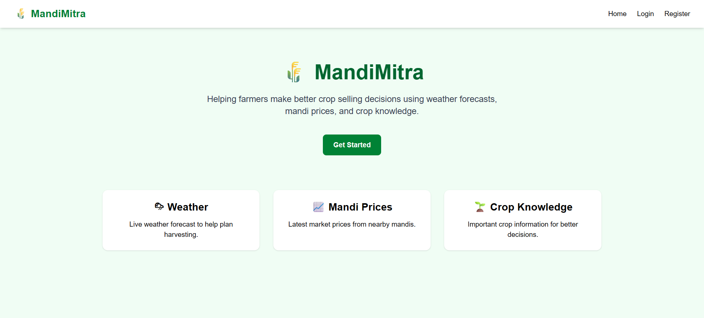
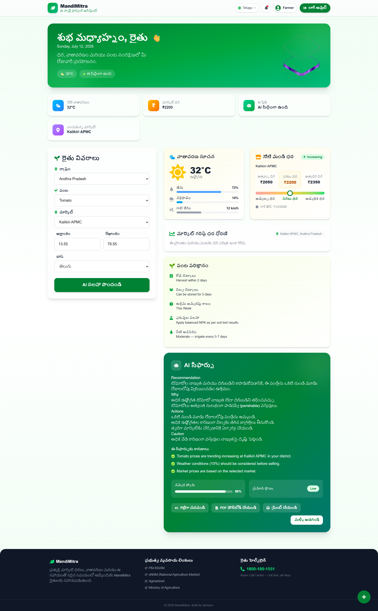
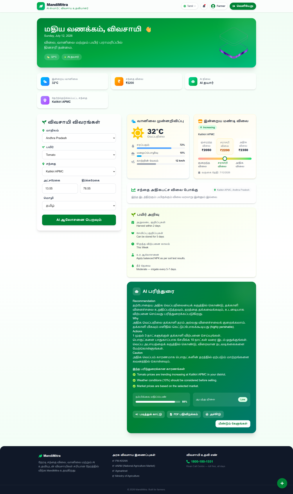
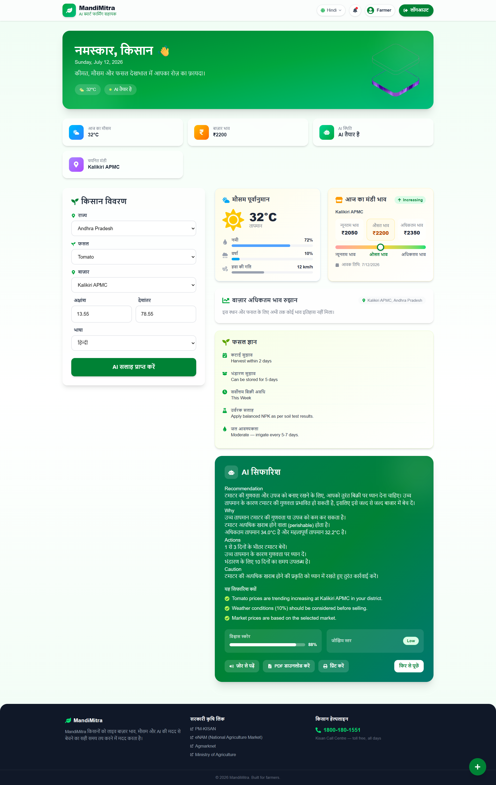
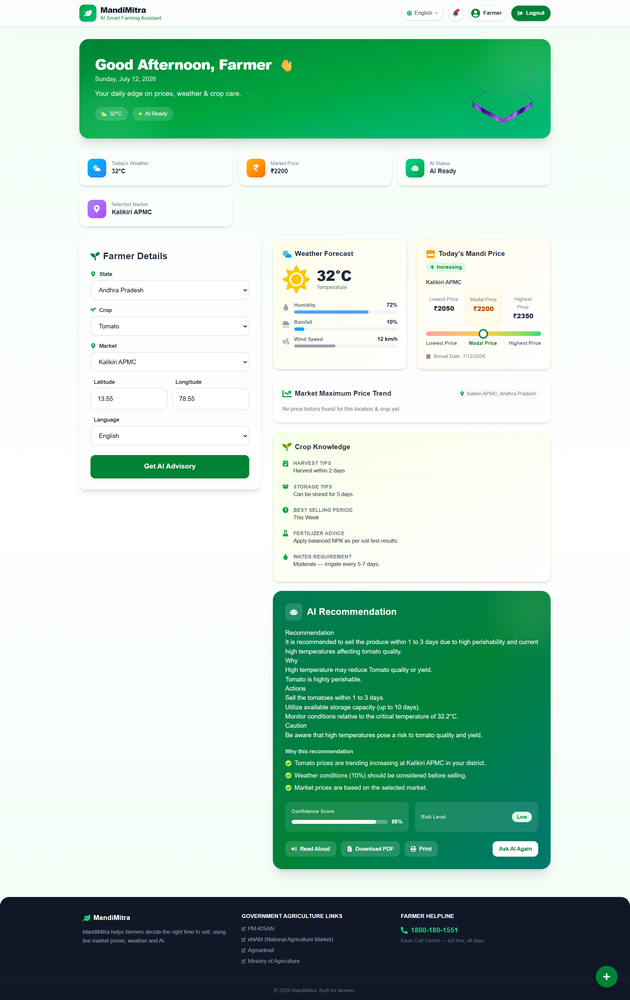

# 🌾 Mandi Mitra

**Mandi Mitra** is an AI-powered decision-support tool that helps Indian farmers decide **when and where to sell their crops**, by combining live weather data, real-time mandi (market) prices, historical price trends, and crop-specific agricultural knowledge — then turning all of it into a simple, trustworthy advisory using **Gemma**.


[▶️ DEMO VIDEO](https://youtu.be/57g8IAp2zXY)


## 1. The Problem

Meet **Ramesh, a marginal potato farmer near Madanapalle, Chittoor district, Andhra Pradesh**, who sells his produce at Palamaner APMC. Every harvest, he faces the same dilemma: sell today at whatever price the mandi is quoting, or hold for a few days hoping the price improves?

He has no easy way to answer this. He can't tell if today's price dip is a one-day blip or the start of a real slide. He has no visibility into whether the next few days of heat or rain will spoil his stock before he can even transport it to the market. And even if he had access to raw price charts or a weather app, most of that information comes in English or generic units that don't translate into a clear "sell now" or "wait" decision — let alone the language he is comfortable in

This is the gap Mandi Mitra is built for: **small and marginal farmers who need a clear, localized, trustworthy answer to "should I sell now or wait?" — not raw data they have to interpret themselves.**


## 2. The Solution

Mandi Mitra is a tool where a farmer simply enters their **state, district, market, crop, and preferred language**. In return, they get a short, plain-language advisory — in their own language — telling them whether to sell now, sell soon, or wait a day and watch the market, along with the reasons why.

If a non-technical family member read this: Mandi Mitra checks today's market price, checks the next few days' weather, checks what that crop needs to stay fresh, and then tells the farmer in simple Telugu (or Hindi, etc.) whether it's a good day to sell — the same way a knowledgeable friend at the mandi might.

The key design choice: **the AI model is never asked to make the decision itself.** A separate, transparent rule engine looks at the numbers and decides what matters and why. The AI model (Gemma) only turns that decision into natural, easy-to-read language. This keeps the system factual and hallucination-resistant, instead of trusting an LLM to reason over raw numbers on its own.

Mandi Mitra does **not** predict future prices or guarantee profits — it presents current market and weather conditions so farmers can decide with confidence.


## 3. How It Works

### User Flow
1. Farmer opens the Webpage and enters **State, Market, Location and Crop**, and picks a **preferred language**.
2. Within seconds, the app returns: current price, 7-day trend, weather outlook, a recommended action, and the reasons behind it.

### Components
| Component | Role |
|---|---|
| **ReactJS UI** | Collects farmer inputs, displays the final advisory |
| **Backend (Python)** | Orchestrates data fetching and calls the rule engine |
| **Weather API** | 5-day forecast in 3-hour intervals (temperature, rain probability, conditions) |
| **Mandi API (AGMARKNET)** | Live/recent mandi prices for the selected crop and market |
| **Cost DB (SQLite)** | Stores the previous 7 days of price history for trend calculation |
| **Crop Knowledge Base (JSON)** | Per-crop thresholds — critical heat/cold limits, storage life, rain/waterlogging sensitivity, perishability |
| **Intermediate Rule Layer** | Converts raw weather + price + crop data into risk flags, facts, and a decision |
| **Gemma** | Converts the rule engine's facts and decision into a localized, farmer-friendly advisory |

### Where Gemma Sits in the Pipeline
Gemma sits **at the very end** of the pipeline, and only sees:
- The final rule-based decision (e.g., "sell within 1–3 days")
- A short list of already-verified facts (e.g., "price rose 7% in 7 days," "max forecast temperature is 34°C, above the crop's safe limit")
- The reasons those facts matter

Gemma never sees raw price tables or full weather JSON, and it never makes the sell/wait decision itself — it only phrases an already-made decision in plain, localized language. See the [Detailed Workflow](#detailed-workflow-step-by-step) in the Appendix for the full step-by-step breakdown of exactly how the rule engine derives these facts.


## 4. Results

> 📸 **Screenshots:**


> **Home Page**

> **Telugu Language**

> **Tamil Language**

> **Hindi Language**

> **English Language**



### Sample Input → Output

**Input**
| Field | Value |
|---|---|
| Crop | Potato |
| State | Andhra Pradesh |
| Market | Palamaner APMC |
| Location | Madanapalle area (13.552°N, 78.506°E) |
| Language | Telugu |

**What the rule engine computes internally**
- Latest modal price: ₹1,450/quintal, 7-day change: **+7.2% (rising)**
- Max forecast temperature: **34.0°C**, above Potato's critical maximum of 30.0°C → **heat risk flagged**
- Max rain probability: 20% → no rain risk
- Perishability: medium, storage life: 10 days
- **Facts generated:** *"Latest modal price is Rs.1450 per quintal." "Seven-day price change is +7.20% and the trend is rising." "Maximum forecast temperature is 34.0°C, above Potato's critical maximum of 30.0°C."*
- **Reasons generated:** *"High temperature may reduce Potato quality or yield." "Potato has moderate storage limitations."*
- **Decision:** `sell_within_1_to_3_days` (heat risk overrides the otherwise-favorable rising price trend)

**What the farmer sees (Telugu advisory, illustrative)**
> ప్రస్తుతం బంగాళాదుంప ధర క్వింటాల్‌కు ₹1,450 గా ఉంది, గత వారంతో పోలిస్తే ధర పెరుగుతోంది. అయితే వచ్చే కొద్ది రోజుల్లో ఉష్ణోగ్రత 34°C వరకు పెరిగే అవకాశం ఉంది, ఇది పంట నాణ్యతపై ప్రభావం చూపవచ్చు. కాబట్టి, ధర పెరుగుతున్నప్పటికీ, తదుపరి 1-3 రోజుల్లోపు అమ్మడం మంచిది.
>
> *(This is illustrative sample output for demonstration; actual phrasing will vary slightly each time Gemma generates it.)*


## 5. Limitations


- **Only 6 crops supported** (Tomato, Onion, Potato, Cauliflower, Green Chilli, Brinjal) — adding a new crop requires manually curating its profile in the knowledge base.
- **Only designed for the markets in **Andhra Pradesh**
- **No fallback for missing market data.** If AGMARKNET has no records for a market in the last 7 days, the system currently can't gracefully suggest an alternative market or explain the gap in a farmer-friendly way.
- **Hand-tuned thresholds, not statistically validated.** The 5% price-stability band, the 60% rain-probability trigger, and the heat/cold thresholds come from general agricultural reasoning, not from a validated model trained on historical mandi + weather outcomes.
- **No outlier protection.** A single bad or mistyped price record from AGMARKNET can distort the 7-day average and trend calculation.
- **Weather horizon is capped at 5 days.** The tool cannot factor in longer-range risks (e.g., a cyclone or heatwave arriving 8+ days out).
- **No multi-year seasonality modeling.** Trend detection only looks at the most recent 7-day window, not typical seasonal price patterns for that crop/region.
- **Single market per query.** There's no side-by-side comparison across two or three nearby markets to check where the crop would fetch a better price.
- **Gemma's output is non-deterministic.** The underlying facts and decision are fixed, but exact phrasing can vary slightly run to run.
- **Requires a smartphone/internet** No SMS, IVR, or voice interface yet, which excludes farmers without a data connection or smartphone.
  


## 6. What Next

**If we had another 24 hours**, We'd prioritize:
- Graceful handling when a market has no recent price data (fallback message + nearest market suggestion)
- A basic price-comparison view across 2-3 nearby markets for the same crop

**If we had another month**, We'd build toward:
- Support for more crops, with a lighter-weight process for adding new crop profiles
- Enabling nationwide market access for farmers
- SMS/WhatsApp advisory delivery (for farmers without smartphones)
- Voice-based interaction in the local language
- Statistically validated risk thresholds, trained on historical mandi + weather outcomes instead of hand-tuned rules
- District-level recommendation models and basic yield/disease-risk signals

The path from this prototype to something a real farmer would depend on daily would mainly hinge on **data reliability** (consistent AGMARKNET coverage for small markets) and **distribution** (reaching farmers without smartphones) — the core reasoning pipeline itself already generalizes to new crops and markets fairly easily.


## 7. Credits


**Team Members and Roles**

* **Golla Madhukiran:** Crop Database, Integration(Gemma model)
* **Aditi Baskaran:** Frontend & Backend Development
* **Gudipati Manogna:** AGMARKNET API & Rule Engine
* **Katreddy Preetham Reddy:** Weather API, Integration, and Testing

**Tools, Libraries, and Datasets**

* **AI Model:** Google Gemma (via Ollama)
* **Datasets & APIs:** AGMARKNET (OGD India), OpenWeather
* **Frameworks & Languages:** React, Python, SQLite

**Project Context & Resources**

* This project was developed as part of an AI for Agriculture initiative designed to help Indian farmers make better selling decisions through explainable, multilingual, fact-driven advisory generation.
* For a complete visual breakdown of how our team integrated these tools and data pipelines, please refer to the workflow diagram in ```/assets/architecture.png```.

For more details: go to ```/assets``` folder

## 📎 Appendix: Technical Details

### Tech Stack

| Component | Technology |
|---|---|
| Backend | Python |
| Database | SQLite |
| Data Processing | Pandas |
| Weather API | OpenWeather API (3-hour interval, 5-day forecast) |
| Market Prices | AGMARKNET (OGD India) |
| AI Model | Google Gemma |
| Inference | Ollama / Google AI Studio |
| UI | ReactJS |

### Project Structure

```
MANDI-MITRA/
│
├── agna_market_api
├── assets
│
├── backend/
|   ├──app
|   ├──evaluation
│   |   ├── agmarknet_api.py       # Live mandi price fetching
│   |   ├──crop_knowledge_base.json
│   |   ├── weather_api.py         # 5-day, 3-hour interval forecast
│   |   ├── finalize.py            # Rule engine: facts + justifications
│   |   ├── model.py                # Gemma inference wrapper
│   |   ├── gemma_model.ipynb
│   |   └──README.md
│   |
|   ├──requirements.txt
├── crop_database/
│   ├── crop_knowledge_base.json
|   └── README.md
│
├── database/
│   ├── mandi_prices.db       # Historical 7-day price records
|   └──README.md          
│
├── frontend/
│   ├── src
│   ├── README.md       # Live mandi price fetching
│   ├── eslint.config.js
│   ├── index.html        # 5-day, 3-hour interval forecast
│   ├── package-lock.json            # Rule engine: facts + justifications
│   ├── package.json                # Gemma inference wrapper
│   └──vite.config.js
│   
├── assets/
│   ├── architecture.png
│   ├── english.png
│   ├── farmer_dashboard.png      # Live mandi price fetching
│   ├── home_page.png
│   ├── loading_page.png     # 5-day, 3-hour interval forecast
│   ├── login_page.png           # Rule engine: facts + justifications
│   ├── logo.png                # Gemma inference wrapper
│   ├── tamil.png
│   └──telugu.png
├── .gitignore
├── License
├── README.md
├── package-lock.json
└── requirements.txt
```

### Detailed Workflow (Step-by-Step)

1. **Farmer Input** — State, location, market, crop, and preferred language, entered via the Webpage.
2. **Market Data Collection** — The AGMARKNET API is queried for the crop's price records in the selected market: current modal price, min/max price, and market location, combined with the **Cost DB**'s stored history for the last 7 days.
3. **Weather Collection** — The OpenWeather API returns a forecast in **3-hour intervals for the next 5 days**: temperature, rain probability, and general conditions.
4. **Crop Knowledge Lookup** — The crop's profile is pulled from the **Crop Knowledge Base**: optimal temperature range, critical heat/cold thresholds, storage life, perishability, and rain/waterlogging sensitivity.
5. **Market Summarization** — The last 7 valid price records are reduced to a 7-day average, day-over-day change, 7-day change, and a `rising`/`falling`/`stable` trend label (see below).
6. **Weather Summarization** — The 3-hour forecast blocks are grouped into daily min/max temperature and max rain probability for each of the next 5 days (see below).
7. **Rule-Based Reasoning** — The market summary, weather summary, and crop profile are cross-checked to flag heat/cold/rain risk, and to produce a final decision plus a list of supporting facts and reasons (see below).
8. **Gemma Advisory Generation** — The decision, facts, and reasons — never the raw data — are compressed into a compact prompt and sent to Gemma, which generates the final advisory in the farmer's chosen language.
9. **Farmer sees**: current market price, price trend, weather summary, recommended action, supporting facts/evidence, and a disclaimer.

### Example Workflow

```
Farmer
     │
     ▼
Select State, Market, Crop & Language
     │
     ▼
┌─────────────┬─────────────┬──────────────┬────────────────────┐
▼             ▼             ▼              ▼
Weather API   Mandi API     Cost DB        Crop Knowledge Base
(5-day,       (live/recent  (7-day         (heat/cold/rain
3-hr interval) price)       history)        sensitivity, storage)
     │             │             │              │
     └─────────────┴─────────────┴──────────────┘
                        ▼
              Intermediate Rule Layer
        (7-day avg, trend, weather risk,
              crop constraints)
                        ▼
         Facts + Reasons + Decision
                        ▼
                     Gemma
                        ▼
       Farmer Advisory (chosen language)
```

### Market Price Summarization
The raw AGMARKNET history is cleaned and reduced to the **last 7 valid daily records** (deduplicated by date, sorted chronologically). From this, the system computes:
- The **latest modal price**, min price, and max price
- The **7-day average modal price**
- **Day-over-day % change** (latest vs. previous day)
- **7-day % change** (latest vs. first record in the window)
- A **trend label** — `rising`, `falling`, or `stable`. Changes smaller than **±5%** over 7 days are treated as noise and labeled `stable`.

### Weather Summarization
The OpenWeather forecast returns data in **3-hour blocks**; these are grouped **per calendar day** (up to 5 days) to compute:
- Minimum and maximum temperature for each day
- The **maximum rain probability** seen that day
- A merged list of weather conditions reported that day

### Rule-Based Decision Engine
A deterministic Python function turns the market summary, weather summary, and crop profile into **risk flags, facts, and reasons**, before any LLM is involved:

- **Heat risk** — flagged if the crop is heat-sensitive and the forecasted max temperature exceeds the crop's critical maximum temperature.
- **Cold risk** — flagged if the forecasted minimum temperature falls below the crop's critical minimum temperature.
- **Rain risk** — flagged if the max rain probability is **≥ 60%** and the crop is rain- or waterlogging-sensitive.
- **Perishability signal** — high/medium perishability is factored in as an additional reason to act sooner.

Decision policy:

| Condition | Decision |
|---|---|
| Any heat, cold, or rain risk is present | **Sell within 1–3 days** |
| Crop is perishable and price trend is falling | **Sell soon** |
| Price trend is rising, storage life ≥ 7 days, and perishability is not high | **Monitor for 1 day before selling** |
| None of the above | **Sell soon** (default, cautious fallback) |

### Why Facts-First, Not Data-First
Python and the intermediate rule layer decide **what matters and why**; Gemma only translates already-verified facts and reasons into natural language. This removes hallucination risk from the decision itself and makes every recommendation traceable back to a specific fact the rule engine generated.

### Supported Crops
Tomato, Onion, Potato, Cauliflower, Green Chilli, Brinjal — each with a dedicated profile in the Crop Knowledge Base covering storage life, heat/cold sensitivity, and rain/waterlogging sensitivity.

### Safety Notes
Mandi Mitra is a decision-support system, not a predictive trading platform. It does not predict future prices, does not guarantee profits, and does not recommend pesticides or fertilizers. Farmers are encouraged to verify local market conditions before making final decisions.
